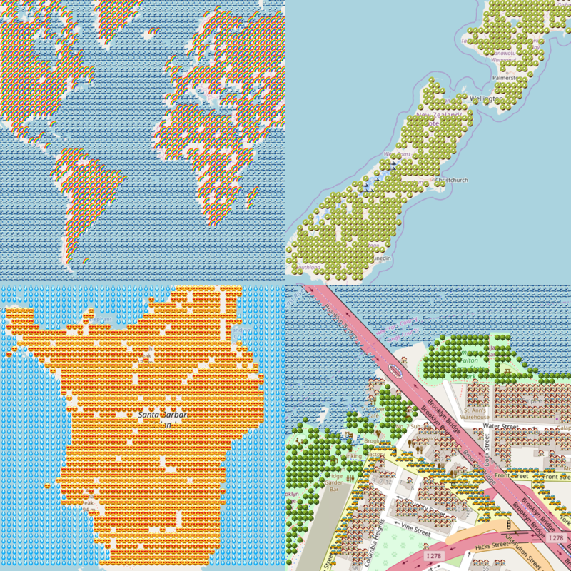
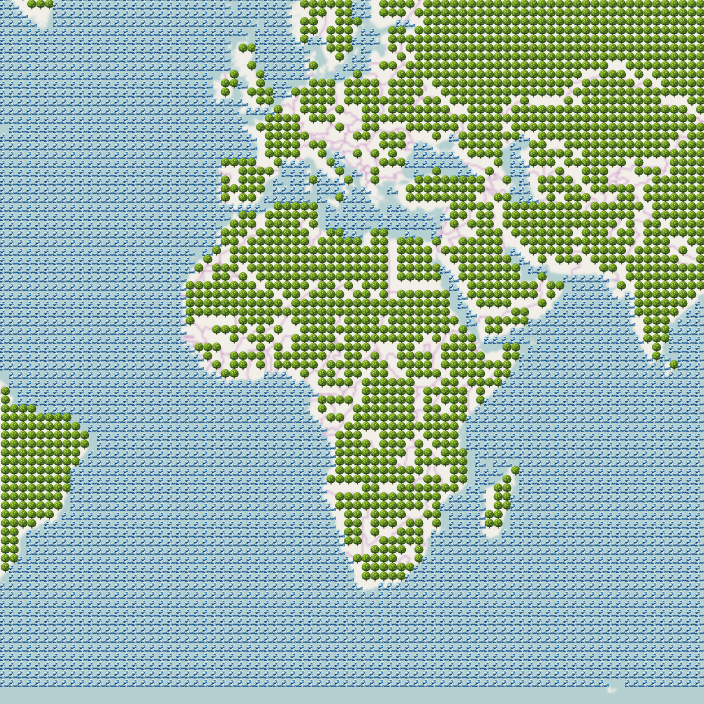
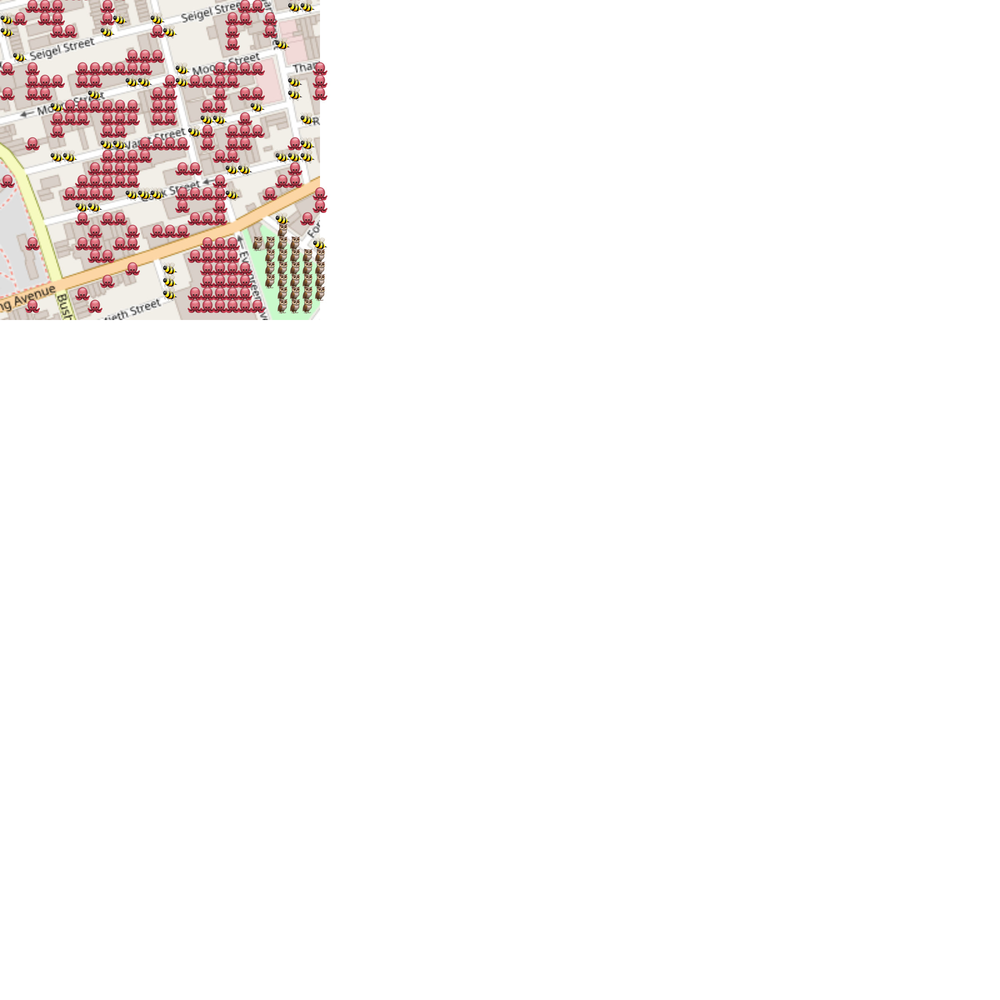
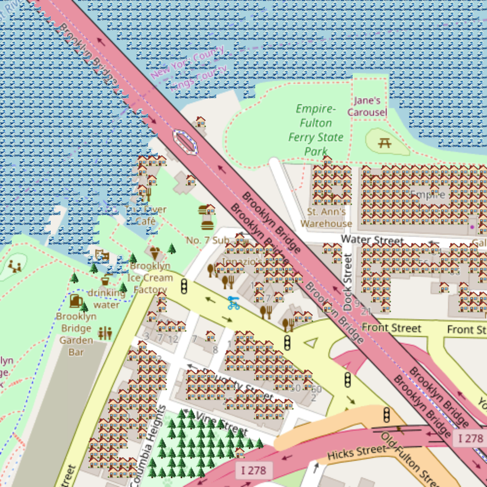

# Map, Image, Emoji


## Workshop 



Title: Let's Make Emoji Maps!
With: Joey Lee (tw: @leejoeyk)

About: 
Let's Make Emoji Maps! Emojis are an expressive (and fun) means of representing emotions and actions as well as physical features. There's plenty of great examples of people using emojis in maps like the Emoji Weather Maps (https://blog.darksky.net/emoji-maps/) or the Emoji Atlas (https://twitter.com/emojiatlas?lang=de), all of which use emojis as a way to symbolize various things in geography. In this workshop, we will use emoji mapping as a way to explore some new ways of representing space as well as some concepts around data processing (e.g. pixel matching!). 

This workshop will be a fun evening of tweaking code and creating emoji maps that mean something different for each of us. I'd ❤️ to 👀 you!


***

# Setup

## Materials

If you're reading this, then you've found all the materials you need for the workshop! The best way for learning is to download the repository so you can tweak the code and see what happens.

## A quick note on browsers

### Chrome

* things should work fine here without any fiddling. 

### Firefox

* Note if you are using firefox, you will have to disable hardware acceleration to get your emoji's to show up. You can find out more here. 
* to disable: preferences > general > performance: uncheck "use hardware acceleration when possible"

## A simple webserver

* There's a bunch of ways to get a webserver running in your machine. 
* I'd suggest:

On mac:

```
python -m SimpleHTTPServer

# see: localhost:8000
```

or any platform that can run Node.js, use the `http-server` npm module:

```
# install the module
npm install http-server -g

# run, user the --cors flag in case you get cross-origin issues
http-server 

# see: http://127.0.0.1:8080 
```

## A color picker plugin 

A color picker plugin will be useful for getting the color values from the images you wish to process. I use [ColorZilla](http://www.colorzilla.com/) but there are a number out there for your browser of choice. 

***


# Overview

* A short introduction
* 

# Short Introduction

In this workshop we are going to take advantage of `leaflet.js` and `openstreetmap` as our web mapping and data source and the functionality of `p5.js` as a creative coding tool to produce our emoji maps. 

The principle idea we will be working with is the concept of "pixel matching". Pixel matching is the process of reading through each pixel in an image and match it with something, like emojis, based on some conditions we specify.

By applying the principle of pixel matching onto static map images, we can then match our emojis onto the map based on rgb pixel values of interest. That means you might apply a 🌳 to a park with rgb(0, 255, 0) which is green or a 🌊 to rgb(0, 0, 255) which is blue.

Taken further, you might then think about generating or supplying your own maps where certain rgb colors are associated with emotions 😍 / 😭 and therefore represent explore more social geographies.


# Part 1: [Examples](examples/)

We're going to go through the examples incrementally in the `examples/` directory to get a better idea about how leaflet.js and p5.js all fit together. Let's dive in 🏊‍♀️!

You will notice comments in all of the examples. Where the comments is prefaced with: `@MODIFY` is where you should be looking to tweak and modify the code to see what happens. If you're more advanced, then feel free to get all up in there 

## [Example 1: 01-simple-image](examples/01-simple-image/)



This is a simple example that takes in a static image in a folder → reads it into p5's canvas object  → then says, "for the following pixel values, assign emoji A to rgb 1,2,3, then emoji B to rgb 2,3,4 and so on"

## [Example 2: 02-static-map](examples/02-static-map)



This is a simple example that takes in a static image tile based on the openstreetmap tile specified by a lat/lon/zoom → reads it into p5's canvas object  → then says, "for the following pixel values, assign emoji A to rgb 1,2,3, then emoji B to rgb 2,3,4 and so on"

## [Example 3: 03-dynamic-map](examples/03-dynamic-map)



This is a simple example that takes in set of image tiles dynamically based on the openstreetmap tile specified by the viewport of the interactive map → reads it into p5's canvas object → then says, "for the following pixel values, assign emoji A to rgb 1,2,3, then emoji B to rgb 2,3,4 and so on" 

A new map can then be generated for different viewports. If you wish to change the rgb values and the emojis represented, you must change the code.


### The `EmojiMapFromTiles` Object

This is a quick shout out to Object Oriented Programming (OOP) - it can be really helpful to build more readable and organized code bits. Here we create an object called `EmojiMapFromTiles`  that contains the properties and functionality of our emoji generating activities. 

Here's a summary of what's going on here:


> // FIRST: we declare a variable to store our object

```
var myEmojiMap;
```
...


> // SECOND: we create and new EmojiMapFromTiles object and store it into our myEmojiMap variable

```
var myEmojiMap = new EmojiMapFromTiles(mymap);
```

...

> // THIRD: when the page loads, we call .makeEmojiMap() on our myEmojiMap object to create our emoji map

```
myEmojiMap.makeEmojiMap();
``` 

This is a really super duper quick and dirty explanation of what's going on, but hopefully when you remix the code, it will feel more clear.

 
# Part 2: [App](app/)


The app extends [Example 3: 03-dynamic-map](examples/03-dynamic-map) by creating an interface around it. You can now change the parameters using the simple and silly user interface provided.


# Notes/Resources:

* link to dan shiffmans coding train - channel: [https://www.youtube.com/user/shiffman](https://www.youtube.com/user/shiffman)
* link to dan shiffmans coding train - pixel matching tutorial: [https://www.youtube.com/watch?v=bkGf4fEHKak&list=PLRqwX-V7Uu6aKKsDHZdDvN6oCJ2hRY_Ig](https://www.youtube.com/watch?v=bkGf4fEHKak&list=PLRqwX-V7Uu6aKKsDHZdDvN6oCJ2hRY_Ig)
* p5.js + community: [https://p5js.org/](https://p5js.org/)
* leaflet.js: [http://leafletjs.com/](http://leafletjs.com/)
* leaflet-image library: [https://github.com/mapbox/leaflet-image](https://github.com/mapbox/leaflet-image)
* leaflet-emoji: [https://github.com/nerik/Leaflet.Emoji](https://github.com/nerik/Leaflet.Emoji)
	- [https://nerik.github.io/Leaflet.Emoji/#emoji_nyc](https://nerik.github.io/Leaflet.Emoji/#emoji_nyc)
	- [https://nerik.github.io/Leaflet.Emoji-slides/#/1](https://nerik.github.io/Leaflet.Emoji-slides/#/1)